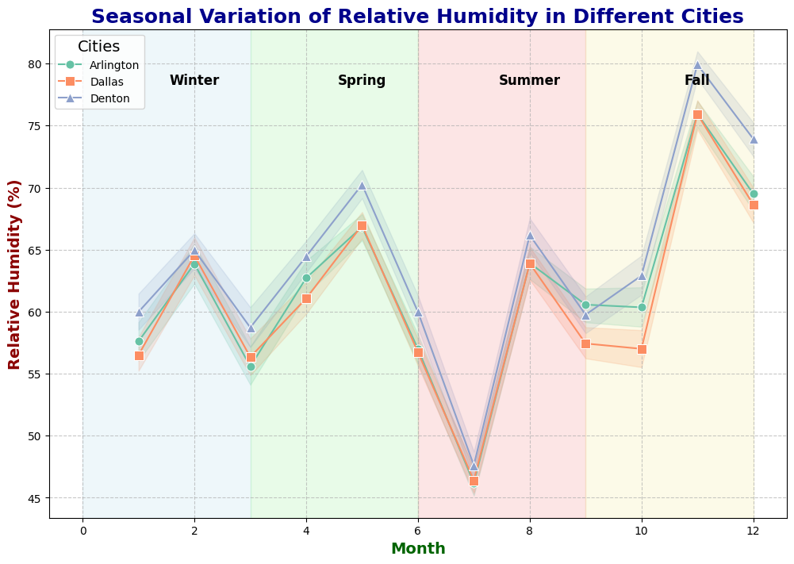
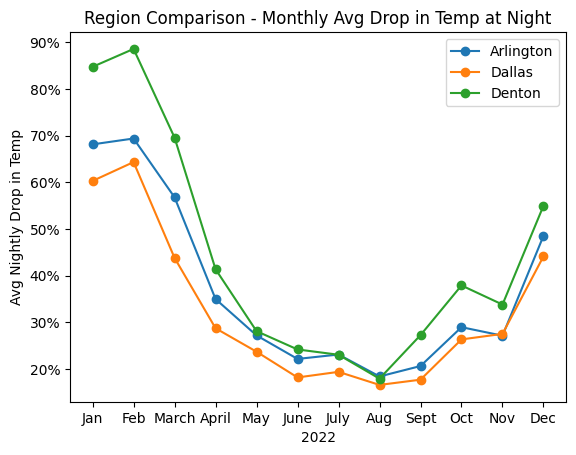
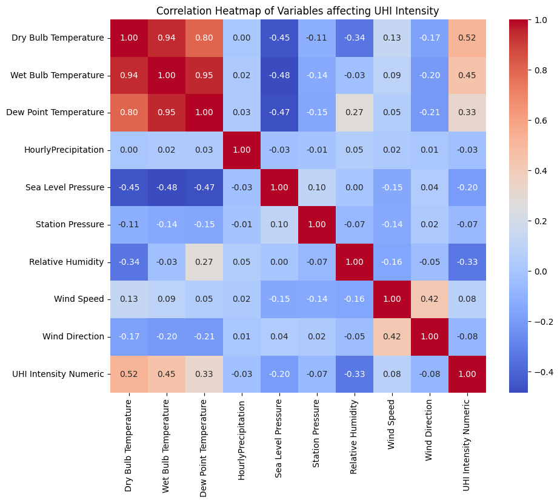

###### (Link to PDF Presentation) {background-image="images/dallas-united-states-travel-blog.jpg" background-opacity="0.35"}

{fig-align="center"}

## **Abstract**

This project aims to study and analyze climatological data for Dallas, Arlington, and Denton, categorizing them based on an "Urban Heat Island" (UHI) scale. By leveraging data mining and machine learning, the goal is to understand the microclimatic effects of urbanization in different settings and classify UHI intensity levels. The project will focus on three key aspects:

1.  **Dallas (Significant City):**

    -   Analyzing UHI in a major metropolitan area.

    -   Considering factors such as pollution, land use, and climate to determine UHI intensity.

2.  **Arlington (Suburban Town):**

    -   Evaluating UHI in a suburban setting with moderate population density.

    -   Comparing UHI variations in less densely populated areas.

3.  **Denton (Rural City):**

    -   Examining UHI in a rural city with lower population density.

    -   Considering factors like reduced pollution and different land use patterns.

## **Introduction**

Urbanization has been a significant driver of environmental change, leading to the development of Urban Heat Islands (UHIs) in metropolitan areas. These UHIs, characterized by elevated temperatures in urban regions compared to their rural surroundings, have garnered substantial attention due to their potential impact on local climates and communities. In response to this, the current project aims to conduct a detailed investigation into the climatological data of Dallas, Arlington, and Denton, with a specific focus on categorizing and understanding the UHI phenomenon. By leveraging advanced data mining and machine learning methodologies, the project seeks to unravel the intricate microclimatic effects associated with urbanization in these diverse settings. The utilization of these cutting-edge techniques will enable the classification of UHI intensity levels, providing valuable insights into the varying degrees of urban heat island effects within the specified locations. The significance of this research lies in its potential to contribute to a deeper understanding of the implications of urbanization on local climates, thereby facilitating informed decision-making and the development of targeted mitigation strategies. Through the comprehensive analysis of UHI effects in Dallas, Arlington, and Denton, this project endeavors to shed light on the complex interplay between urban development and climatological dynamics, ultimately paving the way for more sustainable and resilient urban planning and environmental management.

## **Dataset:**

Climatological and hourly time-series data have been collected from various weather stations, providing key daily summaries for Arlington, Dallas, and Denton in 2022. The dataset includes information on temperature, precipitation, pressure, humidity, wind speed, and more.

## **Methodology:**

Utilizing data mining and machine learning techniques, the project will detect and analyze UHIs, providing insights into the impact of urbanization on micro-climates. The analysis includes visualizations and classification methods to interpret varying UHI intensity levels.

## **Questions:**

1.  How does UHI intensity vary between urban and rural settings throughout the year, and what methods can be employed to classify and interpret these intensity levels?

    -   Investigating variations in UHI intensity between metropolitan and rural areas.

    -   Employing multi-class classification to classify and interpret intensity levels.

2.  How can time series data visualizations effectively illustrate variations in UHI intensity across metropolitan and rural areas like Arlington, Dallas, and Denton over a given year, highlighting distinct temporal patterns?

    -   Exploring time series analysis to visualize UHI intensity changes over seasons.

    -   Identifying patterns that differentiate between urban and rural heat impacts across the specified region.

This project will contribute to the understanding of UHI dynamics in different urban environments and provide valuable insights for sustainable urban development and climate resilience.

## **Data Analysis and Visualizations:**

In this project we're employing data visualization techniques to explore and compare the seasonal variation of relative humidity in three different cities---Arlington, Dallas, and Denton.Plot is showcasing the hourly relative humidity trends across each month. The distinctive line styles and markers aid in differentiating data points for each city.

{fig-align="center"}

Here we're trying to elucidate and compare the nighttime temperature variations in the specified regions throughout the year 2022 across three regions Arlington, Dallas, and Denton. Focusing on nighttime values and excluding midnight data, we're calculating the nightly rate of change between high and low temperatures for each region. The average monthly temperature rate of change is then computed for each city, providing insights into the variations in nightly temperature patterns over the course of the year. The resulting line plot visualizes these monthly averages, highlighting the distinctive temperature trends for each region.\

{fig-align="center"}

The heatmap visually represents the correlation coefficients between these variables, providing insights into how changes in one meteorological factor may be associated with changes in UHI Intensity. This analysis helps in understanding the interdependencies and potential contributing factors to the UHI phenomenon in the selected locations.

The correlation heatmap is to explore the relationships between various meteorological variables and the Urban Heat Island (UHI) Intensity in three different locations: Dallas, Denton, and Arlington. The selected variables include Dry Bulb Temperature, Wet Bulb Temperature, Dew Point Temperature, Hourly Precipitation, Sea Level Pressure, Station Pressure, Relative Humidity, Wind Speed, Wind Direction, and UHI Intensity Numeric.

{fig-align="center"}

## **Conclusion**

The analysis of climatological data for Dallas, Arlington, and Denton has provided valuable insights into the Urban Heat Island (UHI) phenomenon, shedding light on the complex interplay between urban development and climatological dynamics. By leveraging data mining and machine learning techniques, this project has successfully categorized and understood UHI intensity levels in diverse urban and rural settings. The significance of this research lies in its potential to contribute to a deeper understanding of the implications of urbanization on local climates, thereby facilitating informed decision-making and the development of targeted mitigation strategies. The findings of this analysis have revealed distinct UHI intensity variations across the studied locations. In Dallas, a major metropolitan area, the UHI intensity was found to be significantly influenced by factors such as pollution, land use, and climate, leading to higher UHI levels. Conversely, in Arlington, a suburban town with moderate population density, and Denton, a rural city with lower population density, the UHI intensities were comparatively lower, with varying influences from factors such as land use patterns and reduced pollution. The project's data analysis and visualizations have effectively illustrated the seasonal and temporal variations in UHI intensity across the studied areas, providing comprehensive insights into the microclimatic effects of urbanization. The correlation heat-maps analysis has further elucidated the inter dependencies and potential contributing factors to the UHI phenomenon in the selected locations. In conclusion, this project has significantly advanced the understanding of UHI dynamics in different urban environments, laying the groundwork for informed urban planning, environmental management, and climate resilience strategies. The insights gained from this analysis will be instrumental in guiding sustainable urban development practices and fostering the creation of targeted UHI mitigation measures. The project's comprehensive approach to UHI analysis has not only contributed to the scientific understanding of UHI dynamics but also holds practical implications for creating healthier and more sustainable urban environments.
